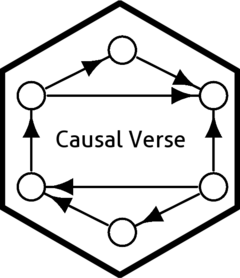

# causalverse 

<!-- badges: start -->

[](https://lifecycle.r-lib.org/articles/stages.html#experimental) [](https://github.com/mikenguyen13/causalverse/actions/workflows/R-CMD-check.yaml) [](https://www.repostatus.org/#active) [](https://zenodo.org/badge/latestdoi/679072435)

<!-- badges: end -->

The primary aim of causalverse is to streamline the research process, particularly data analysis, for researchers working in causal inference. It offers a range of helper functions designed to minimize time spent on data analysis. The package includes methods such as regression discontinuity, difference-in-differences, synthetic control, instrumental variables, event studies, and more. Additional methods may be introduced in future updates.

## How to cite this package

You can cite this package as follows: "we utilized the causal inference methodologies from the `causalverse` R package (Nguyen 2023)". Here is the full bibliographic reference to include in your reference list (don't forget to update the 'last accessed' date):

> Nguyen, M. (2023). The causalverse Package: Causality in Clarity. Zendono. <http://doi.org/10.5281/zenodo.8254063>. Retrieved from <https://github.com/mikenguyen13/causalverse>.

## [Vignettes](https://mikenguyen13.github.io/causalverse)

All the vignettes can be accessed via the package's website.

## Installation

You can install the development version of causalverse from [GitHub](https://github.com/) with:

``` r
# install.packages("devtools")
devtools::install_github("mikenguyen13/causalverse")
```

## Example

This is a basic example which shows you how to solve a common problem:

``` r
library(causalverse)
## basic example code
```

## Citaiton

Nguyen, M. (2023). The causalverse Package: Causality in Clarity. Zenodo. <http://doi.org/10.5281/zenodo.8254063>. Retrieved from <https://github.com/mikenguyen13/causalverse>.
