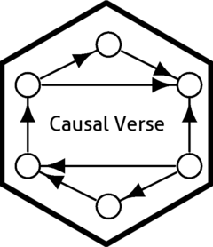

# causalverse 

<!-- badges: start -->

[](https://lifecycle.r-lib.org/articles/stages.html#stable) [](https://github.com/mikenguyen13/causalverse/actions/workflows/R-CMD-check.yaml) [](https://www.repostatus.org/#active) [](https://zenodo.org/badge/latestdoi/679072435)

<!-- badges: end -->

**causalverse** is the all-in-one R toolkit for causal inference — the *tidyverse* of causal analysis. Version 1.1.0 provides 80+ utility functions, 13 in-depth vignettes, and seamless integration with 100+ backend packages, covering the full pipeline from experimental design through publication-ready reporting.

The package covers **13 major method families**:

| Method | Key Functions | Backend Packages |
|--------|--------------|------------------|
| **Synthetic DID** | `synthdid_est()`, `synthdid_est_ate()`, `sc_gap_plot()` | synthdid |
| **Difference-in-Differences** | `did_event_study()`, `staggered_summary()`, `bacon_decomp_plot()`, `did_power_analysis()` | fixest, did, did2s, bacondecomp, HonestDiD |
| **Randomized Experiments** | `mde_calc()`, `dr_ate()`, `placebo_test()`, `attrition_analysis()`, `power_sim()` | estimatr, grf, DoubleML |
| **Regression Discontinuity** | `rd_plot()`, `rd_assumption_tests()`, `rd_bandwidth_sensitivity()` | rdrobust, rddensity, rdpower |
| **Synthetic Controls** | `panel_estimate()`, `sc_gap_plot()` | Synth, augsynth, gsynth |
| **Instrumental Variables** | `iv_diagnostic_summary()`, `iv_sensitivity()` | ivreg, ivmodel, hdm, MendelianRandomization |
| **Finance Event Studies** | `event_study_finance()`, `plot_event_coefs()` | fixest, estudy2 |
| **Matching & Weighting** | `balance_plot()`, `love_plot()`, `overlap_weights()`, `covariate_summary()` | MatchIt, cobalt, WeightIt |
| **Heterogeneous Effects** | `blp_analysis()`, `qini_curve()`, `causal_forest_summary()`, `heterogeneity_plot()` | grf, policytree |
| **Mediation Analysis** | `mediation_analysis()`, `lee_bounds()` | mediation, lavaan |
| **Panel Data** | `panel_diagnostics()` | plm, tseries |
| **Causal DAGs** | `dag_plot()`, `dag_adjustment_sets()`, `dag_test_implications()` | dagitty, ggdag |
| **Sensitivity & Robustness** | `multiverse_analysis()`, `spec_curve()`, `sensitivity_plot()`, `pretrend_sensitivity()` | sensemakr, EValue, HonestDiD |

## How to cite this package

You can cite this package as follows: "we utilized the causal inference methodologies from the `causalverse` R package (Nguyen 2026)". Here is the full bibliographic reference to include in your reference list (don't forget to update the 'last accessed' date):

> Nguyen, M. (2026). causalverse: The All-in-One Causal Inference Toolkit (Version 1.1.0). Zenodo. <https://doi.org/10.5281/zenodo.8254063>. Retrieved from <https://github.com/mikenguyen13/causalverse>.

## [Vignettes](https://mikenguyen13.github.io/causalverse/articles/)

13 comprehensive, journal-quality tutorials covering every major causal inference method:

- [0. Introduction](https://mikenguyen13.github.io/causalverse/articles/a_introduction.html) -- Package overview, function index, quick-start examples
- [1. Randomized Control Trials](https://mikenguyen13.github.io/causalverse/articles/d_rct.html) -- RCTs, adaptive experiments, SUTVA, interference
- [2. Regression Discontinuity](https://mikenguyen13.github.io/causalverse/articles/e_rd.html) -- Sharp, fuzzy, multi-cutoff, assumption tests
- [3. Synthetic DID](https://mikenguyen13.github.io/causalverse/articles/b_synthdid.html) -- SDID, staggered SDID, placebo inference
- [4. Difference-in-Differences](https://mikenguyen13.github.io/causalverse/articles/c_did.html) -- TWFE, CS DiD, stacked DiD, HonestDiD
- [5. Synthetic Controls](https://mikenguyen13.github.io/causalverse/articles/f_sc.html) -- SCM, augmented SC, penalized SC, RMSPE inference
- [6. Instrumental Variables](https://mikenguyen13.github.io/causalverse/articles/g_iv.html) -- 2SLS, Bartik, Mendelian Randomization, MTE
- [7. Finance Event Studies](https://mikenguyen13.github.io/causalverse/articles/h_event_study.html) -- CAR, BHAR, wealth effects, intraday
- [8. Matching Methods](https://mikenguyen13.github.io/causalverse/articles/i_matching.html) -- PSM, CEM, genetic matching, entropy balancing
- [9. Sensitivity Analysis](https://mikenguyen13.github.io/causalverse/articles/j_sensitivity.html) -- OVB, E-values, Manski bounds, spec curves
- [10. Heterogeneous Treatment Effects](https://mikenguyen13.github.io/causalverse/articles/k_hte.html) -- Causal forests, BLP, GATES, Qini, DML
- [11. Causal Mediation](https://mikenguyen13.github.io/causalverse/articles/l_mediation.html) -- ACME, ADE, SEM, moderated mediation
- [12. Panel Data Methods](https://mikenguyen13.github.io/causalverse/articles/m_panel.html) -- FE, RE, GMM, unit roots, cross-sectional dependence

## Installation

You can install the development version of causalverse from [GitHub](https://github.com/mikenguyen13/causalverse) with:

``` r
# install.packages("pak")
pak::pkg_install("mikenguyen13/causalverse")
```

Or using devtools:

``` r
# install.packages("devtools")
devtools::install_github("mikenguyen13/causalverse")
```

To install all optional backend packages for full functionality:

``` r
library(causalverse)
install_backends()          # install everything
install_backends("did")     # install just DID packages
install_backends("rd")      # install just RD packages
```

## Quick Examples

### Synthetic Difference-in-Differences

``` r
library(causalverse)
library(synthdid)

# Estimate treatment effect using multiple methods
setup <- synthdid::panel.matrices(synthdid::california_prop99)
estimates <- panel_estimate(setup, c("sc", "sdid", "did", "sc_ridge"))
process_panel_estimate(estimates)

# Staggered adoption with ATE
ate <- synthdid_est_ate(data = fixest::base_stagg, method = "sdid")
synthdid_plot_ate(ate)
```

### Event Study with Publication-Ready Plots

``` r
library(causalverse)
library(fixest)

# Sun & Abraham event study
model <- feols(y ~ sunab(year_treated, year) | id + year, data = base_stagg)

# Plot with causalverse theming
plot_event_coefs(model, ref_period = -1) + ama_theme()
```

### RD Robustness Checks

``` r
library(causalverse)

# Bandwidth sensitivity analysis
rd_bandwidth_sensitivity(data = df, y = "outcome", x = "running_var", c = 0)

# Placebo cutoff tests
rd_placebo_cutoffs(data = df, y = "outcome", x = "running_var", true_cutoff = 0)

# Covariate balance at the cutoff
rd_covariate_balance(data = df, covariates = c("age", "income"), x = "running_var", c = 0)
```

### Specification Curve Analysis

``` r
library(causalverse)

# Run all specifications and visualize
results <- spec_curve(
  data = df,
  y = "outcome",
  x = "treatment",
  controls = list(c("age"), c("age", "income"), c("age", "income", "educ")),
  fixed_effects = list(NULL, "year", c("year", "state"))
)
```

### AMA-Style Publication Plots

``` r
library(causalverse)
library(ggplot2)

ggplot(mtcars, aes(wt, mpg)) +
  geom_point() +
  geom_smooth(method = "lm") +
  ama_theme() +
  ama_labs(x = "Weight", y = "MPG")

# Export for journal submission
ama_export_fig(filename = "figure1", filepath = "output/")
```

## Citation

Nguyen, M. (2026). causalverse: The All-in-One Causal Inference Toolkit (Version 1.1.0). Zenodo. <https://doi.org/10.5281/zenodo.8254063>. Retrieved from <https://github.com/mikenguyen13/causalverse>.
